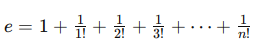

Q: Modify Programming Project 11 so that the program continues adding terms
until the current term becomes less than `E`, where `E` is a small
(floating-point) number entered by the user.

<em>Hint:</em>
(From ChatGPT)

In the context of the series for approximating Euler's number `e`:

a "term" refers to each individual fraction in the series, specifically `1i/i!` where `i` is a non-negative integer (0, 1, 2, 3, ...).

The problem is asking you to modify the previous program so that, instead of adding a fixed number of terms (up to `n`), you continue adding terms until the value of the current term `1/i!` becomes less than a small floating-point number `E` entered by the user. Essentially, you'll keep summing the series until adding further terms has a negligible effect on the total sum, as determined by the user's choice of `E`.

**Resources:**

- [Wikipedia Article on Euler's Number](<https://en.wikipedia.org/w/index.php?title=E_(mathematical_constant)&useskin=vector>)
